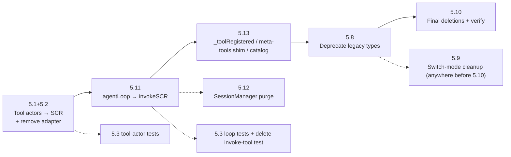

# Implementation Plan: Recursive Capability Composition (SCR)

## Overview
This project transitions the entire Rorschach codebase to a single, unified recursive execution primitive: the **Single Capability Resource (SCR)**. Every task is designed to be completed in a single focused session, including explicit acceptance criteria, files likely touched, verification steps, and dependencies.

## Architecture Decisions
- **URN Scheme**: All capabilities are addressable via a unique URN of the format `scr:<kind>:<namespace>.<name>`.
- **User Budget Actor Persistence**: Keep `UserBudgetActor` instances in memory for the duration of the system lifecycle (no passivation).
- **Concurrency Throttling**: No hard limit on concurrent runners per node; we will rely purely on recursion depth and budget limits.
- **Default Recursion Limit**: Default `maxDepth` is set to 10.
- **Default Budget**: No safety default limits; run with unlimited budget unless specified by the request context.
- **Legacy Deprecation**: Purge legacy agents/tools/topics/executors completely in Phase 5 for a clean zero-backward-compatibility codebase.

---

## Task List

### Phase 0: Types & Foundation

#### Task 0.1: Define Unified SCR Type Specifications
* **Description:** Create the core TypeScript file containing the SCR schemas, URN structure, descriptors, definitions, and message payloads.
* **Acceptance criteria:**
  - [x] TypeScript types `SCRKind` (`'leaf' | 'reasoner' | 'graph' | 'operator'`), `SCRSchema`, `SCRDescriptor` (carrying URN, kind, schemas, target `ActorRef`), `SCRInvokeMsg`, and `SCRReply` compile.
  - [x] Topics `SCRRegistrationTopic` ('scr.registration'), `UsageUpdateTopic` ('scr.usage_update'), and `UserBudgetTopic` ('scr.user_budget') are defined.
* **Verification:**
  - [x] Run typescript compiler check: `bun run typecheck` and verify success.
* **Dependencies:** None
* **Files likely touched:**
  - `src/types/scr.ts` (New file)
* **Estimated scope:** S

#### Task 0.2: Extend Request Context for SCR Capabilities
* **Description:** Modify `MessageRequest` in `request.ts` to support execution metadata, budget parameters, and the channel-agnostic `streamTo` target. Define the structured streaming envelope `StreamChunk`.
* **Acceptance criteria:**
  - [x] `MessageRequest` supports `depth` (number), `maxDepth` (number), `maxTokens` (number), `maxCostUsd` (number), `supportsPending` (boolean), and `streamTo` (string).
  - [x] `createMessageRequest` sets default recursion limit configuration (`depth: 0`, `maxDepth: 10`).
  - [x] `StreamChunk` envelope is fully typed in `src/types/scr.ts`.
* **Verification:**
  - [x] Run typescript compiler check: `bun run typecheck`.
  - [x] Verify context serialization functions round-trip without loss of metadata.
* **Dependencies:** Task 0.1
* **Files likely touched:**
  - `src/system/context/request.ts`
  - `src/types/scr.ts`
* **Estimated scope:** XS

#### Task 0.3: Implement JSON Schema Validator
* **Description:** Create the self-contained validator function `validateSchema` to support input/output schema validation.
* **Acceptance criteria:**
  - [x] `validateSchema` successfully validates dynamic JSON shapes (primitives, nested objects, required arrays, fields checks) and outputs detailed validation error arrays.
  - [x] The validator is exported from the system index.
* **Verification:**
  - [x] Create `src/tests/schema-validator.test.ts` checking validation of complex nested objects and path reporting. Run `bun test src/tests/schema-validator.test.ts`.
* **Dependencies:** None
* **Files likely touched:**
  - `src/system/schema-validator.ts` (New file)
  - `src/system/index.ts`
* **Estimated scope:** S

---

### Checkpoint: Foundation
- [x] All new types compile.
- [x] Context serialization functions round-trip without loss of metadata.
- [x] `validateSchema` compiles and passes all validator unit tests.

---

### Phase 1: Central Registry & Dynamic Discovery

#### Task 1.1: Create Registry Configuration & Types
* **Description:** Setup baseline configuration keys and types for the registry plugin.
* **Acceptance criteria:**
  - [x] Config schema and types defined in `src/plugins/registry/registry.config.ts` and `src/plugins/registry/types.ts` compile.
* **Verification:**
  - [x] Run `bun run typecheck` check.
* **Dependencies:** Task 0.2
* **Files likely touched:**
  - `src/plugins/registry/registry.config.ts` (New file)
  - `src/plugins/registry/types.ts` (New file)
* **Estimated scope:** XS

#### Task 1.2: Implement `SCRRegistry` Actor
* **Description:** Build the central `SCRRegistry` actor to receive registration events on `SCRRegistrationTopic` and maintain the master in-memory directory of URNs and target spawner/actor refs.
* **Acceptance criteria:**
  - [x] `SCRRegistry` processes registry messages and maintains URN descriptors.
* **Verification:**
  - [x] Run local mock test sending registrations and confirming actor directory state matches.
* **Dependencies:** Task 1.1
* **Files likely touched:**
  - `src/plugins/registry/registry-actor.ts` (New file)
* **Estimated scope:** S

#### Task 1.3: Implement Node-Local `ResolutionCache`
* **Description:** Implement `ResolutionCache` subscribing to the retained `SCRRegistrationTopic` and `UserBudgetTopic` to keep hot maps of active URN descriptors and user budget states in memory.
* **Acceptance criteria:**
  - [x] Exposes synchronous lookup for descriptors and budget records without mailbox overhead.
* **Verification:**
  - [x] Test local cache updates immediately when a registration message is published.
* **Dependencies:** Task 1.2
* **Files likely touched:**
  - `src/system/scr/cache.ts` (New file)
* **Estimated scope:** S

#### Task 1.4: Implement Stateless `invokeSCR` Engine
* **Description:** Create the `invokeSCR` library function which synchronously checks permissions, budget, recursion depth limits, and routes the invocation to the resolved `ActorRef`.
* **Acceptance criteria:**
  - [x] `invokeSCR` evaluates local cache data, validates budget/recursion, updates enqueued context, and forwards `SCRInvokeMsg`.
* **Verification:**
  - [x] Unit tests checking recursion detection (rejection at `depth > maxDepth`) and budget overflow rejection.
* **Dependencies:** Task 1.3
* **Files likely touched:**
  - `src/system/scr/invoker.ts` (New file)
* **Estimated scope:** S

#### Task 1.5: Implement Discovery Meta-Tools
* **Description:** Create standard lookup tools `scr:tool:registry.search` and `scr:tool:registry.get` to query registry data.
* **Acceptance criteria:**
  - [x] Both discovery tools are functional and return structured descriptors.
* **Verification:**
  - [x] Verify executing search/get tools returns expected capability descriptions.
* **Dependencies:** Task 1.4
* **Files likely touched:**
  - `src/plugins/registry/meta-tools.ts` (New file)
* **Estimated scope:** S

#### Task 1.6: Build Registry Plugin Bootstrapper
* **Description:** Build `registry.plugin.ts` to instantiate the registry actor and register the meta-tools on startup.
* **Acceptance criteria:**
  - [x] The registry plugin registers itself in the factory and starts during boot.
* **Verification:**
  - [x] System starts up, spawning `SCRRegistry`.
* **Dependencies:** Task 1.5
* **Files likely touched:**
  - `src/plugins/registry/registry.plugin.ts` (New file)
* **Estimated scope:** XS

#### Task 1.7: Refactor `createPluginFactory` for SCR registrations
* **Description:** Modify `factory.ts` to publish tools, agents, and workflows to the unified `SCRRegistrationTopic` pointing to spawner or direct actor references. Remove legacy registration publishing.
* **Acceptance criteria:**
  - [x] `factory.ts` has zero references to `ToolRegistrationTopic` or legacy `AgentRegistrationTopic`.
* **Verification:**
  - [x] Ensure system boot logs confirm registration events published on startup.
* **Dependencies:** Task 1.6
* **Files likely touched:**
  - `src/system/factory.ts`
* **Estimated scope:** S

#### Task 1.8: Workflows Startup Scanning Hook
* **Description:** Add startup scanning inside the workflows plugin to read stored files from database and register current workflow URN descriptors.
* **Acceptance criteria:**
  - [x] Scans files and publishes active workflow descriptors to `SCRRegistrationTopic`.
* **Verification:**
  - [x] Verify startup triggers registration updates for existing workflows.
* **Dependencies:** Task 1.7
* **Files likely touched:**
  - `src/plugins/workflows/workflows.plugin.ts`
  - `src/plugins/workflows/workflow-store.ts`
* **Estimated scope:** S

#### Task 1.9: Implement `UserBudgetActor`
* **Description:** Build the persistent `UserBudgetActor` to load/save user budget totals and broadcast them to the retained topic `UserBudgetTopic`. No passivation of idle budget actors is required.
* **Acceptance criteria:**
  - [x] Accumulates usage updates, uses `persistencePluginAdapter`, and updates retained records.
* **Verification:**
  - [x] Verify state is saved to the database and re-loaded upon actor boot.
* **Dependencies:** Task 1.3
* **Files likely touched:**
  - `src/plugins/observability/user-budget.ts` (New file)
* **Estimated scope:** S

#### Task 1.10: Implement `UserBudgetSupervisor`
* **Description:** Create the budget supervisor actor inside the observability plugin to subscribe to `UsageUpdateTopic` deltas and spawn `UserBudgetActor` child actors on-demand.
* **Acceptance criteria:**
  - [x] Supervisor instantiates on startup and manages child lifecycles.
* **Verification:**
  - [x] Sending usage updates dynamically spawns the corresponding user budget actor.
* **Dependencies:** Task 1.9
* **Files likely touched:**
  - `src/plugins/observability/user-budget.ts`
  - `src/plugins/observability/observability.plugin.ts`
* **Estimated scope:** S

#### Task 1.11: Implement `SCRGCSweeper` GC Task
* **Description:** Create a sweep task to run hourly and clean up orphaned dynamic keys `scr.run.*` of finished/dead runners.
* **Acceptance criteria:**
  - [x] Scanning sweeps database and deletes matching stale KV keys.
* **Verification:**
  - [x] Trigger GC sweep manually and confirm dead runner keys are deleted.
* **Dependencies:** Task 1.4
* **Files likely touched:**
  - `src/system/scr/gc-sweeper.ts` (New file)
* **Estimated scope:** S

---

### Checkpoint: Registry & Discovery
- [x] Code builds without errors.
- [x] Registered tools/agents/workflows publish to `SCRRegistrationTopic` on start.
- [x] Local cache matches published registrations dynamically.
- [x] UserBudgetSupervisor and GC Sweeper initialize successfully.

---

### Phase 2: Leaf (Tool) Integration

#### Task 2.1: Implement Direct Leaf Tool Routing
* **Description:** Update the `invokeSCR` function to direct leaf kind requests to the tool's registered direct `ActorRef`.
* **Acceptance criteria:**
  - [x] Leaf tool execution is correctly triggered via `invokeSCR`.
* **Verification:**
  - [x] Integration tests verify invoking tool URNs returns terminal results.
* **Dependencies:** Task 1.7
* **Files likely touched:**
  - `src/system/scr/invoker.ts`
* **Estimated scope:** S

#### Task 2.2: Add Input Schema Validation Membrane
* **Description:** Add input validation to the tool delegate wrapper using the `validateSchema` utility.
* **Acceptance criteria:**
  - [x] Invoking a tool with incorrect types returns an immediate `SCRReply.error`.
* **Verification:**
  - [x] Unit tests verify validation rejection.
* **Dependencies:** Task 0.3, Task 2.1
* **Files likely touched:**
  - `src/system/scr/invoker.ts`
  - `src/system/agent/tool-utils.ts`
* **Estimated scope:** S

#### Task 2.3: Add Output Schema Validation Membrane
* **Description:** Add output validation to ensure tool execution returns expected data formats.
* **Acceptance criteria:**
  - [x] Incorrect return structures from tool execution trigger an immediate `SCRReply.error`.
* **Verification:**
  - [x] Verify validation errors are generated if output data doesn't match schema.
* **Dependencies:** Task 2.2
* **Files likely touched:**
  - `src/system/scr/invoker.ts`
  - `src/system/agent/tool-utils.ts`
* **Estimated scope:** S

---

### Checkpoint: Leaf Integration
- [x] Invoking leaf URNs works successfully.
- [x] Incorrect input/output payloads are rejected at the membrane boundary.

---

### Phase 3: Reasoner (Agent) SCR Conversion

#### Task 3.1: Build `AgentSpawnerActor` Skeleton
* **Description:** Implement `AgentSpawnerActor` to handle agent URN execution requests.
* **Acceptance criteria:**
  - [x] Spawner instantiates, registers with the registry, and accepts message execution requests.
* **Verification:**
  - [x] System boots and registers `AgentSpawner` to `SCRRegistrationTopic`.
* **Dependencies:** Task 1.7
* **Files likely touched:**
  - `src/system/agent/spawner.ts` (New file)
* **Estimated scope:** S

#### Task 3.2: Implement Ephemeral `SCRAgentRunner` Core Execution
* **Description:** Create the `SCRAgentRunner` actor spawned per agent request to manage inputs, run `agentLoop`, and execute turns. Injects the `scr_complete` tool.
* **Acceptance criteria:**
  - [x] Runner spawns and executes a single ReAct loop successfully.
* **Verification:**
  - [x] Verify basic runner test returns terminal responses.
* **Dependencies:** Task 3.1
* **Files likely touched:**
  - `src/system/agent/agent-runner.ts` (New file)
  - `src/system/agent/agent-loop.ts`
* **Estimated scope:** M

#### Task 3.3: Implement Channel-Agnostic Ambient Streaming
* **Description:** Update `SCRAgentRunner` to intercept internal agent tokens and publish them as `StreamChunk` envelopes out-of-band to the context's `streamTo` target.
* **Acceptance criteria:**
  - [x] Intermediate tokens bypass core mailbox channels and stream to target topics.
* **Verification:**
  - [x] Subscribe to stream topic and verify tokens arrive wrapped in structured envelopes with matching span IDs.
* **Dependencies:** Task 3.2
* **Files likely touched:**
  - `src/system/agent/agent-runner.ts`
* **Estimated scope:** S

#### Task 3.4: Implement Request Context Persistence & Restore
* **Description:** Add persistent state capabilities to `SCRAgentRunner` using `persistencePluginAdapter('scr.run.' + runId)`. Store requests and restore them via `requestStorage.run` on resume. Clean up KV on completion.
* **Acceptance criteria:**
  - [x] Runner serializes state, restores context when re-spawned, and deletes database key on completion.
* **Verification:**
  - [x] Verify database contains runner states during execution, and deletes them upon completion.
* **Dependencies:** Task 3.3
* **Files likely touched:**
  - `src/system/agent/agent-runner.ts`
* **Estimated scope:** S

#### Task 3.5: Implement Job Mapping & Resumption in `AgentSpawnerActor`
* **Description:** Implement `RegisterJobMsg` handling in `AgentSpawnerActor` to save pending job mappings in KV and listen to `JobRegistryTopic` to resume suspended runners.
* **Acceptance criteria:**
  - [x] Spawner maps job IDs, registers mappings in KV database, and resumes runner upon completion events.
* **Verification:**
  - [x] Publish completion event and confirm runner executes subsequent steps.
* **Dependencies:** Task 3.4
* **Files likely touched:**
  - `src/system/agent/spawner.ts`
* **Estimated scope:** M

#### Task 3.6: Integrate Usage Budget Accounting in `SCRAgentRunner`
* **Description:** Update the runner to publish LLM usage updates to `UsageUpdateTopic` to track spending budgets.
* **Acceptance criteria:**
  - [x] Token and cost deltas publish after turns.
* **Verification:**
  - [x] Verify that budget coordinator updates the UserBudget record.
* **Dependencies:** Task 1.10, Task 3.2
* **Files likely touched:**
  - `src/system/agent/agent-runner.ts`
* **Estimated scope:** S

#### Task 3.7: Implement Dynamic Pull-Based Discovery
* **Description:** Update `agentLoop` to search capabilities dynamically via `scr:tool:registry.search` rather than using pre-loaded tools.
* **Acceptance criteria:**
  - [x] Agent binds discovered tool schemas mid-flight.
* **Verification:**
  - [x] Verify agent can successfully find, bind, and execute a notebook tool dynamically.
* **Dependencies:** Task 1.5, Task 3.2
* **Files likely touched:**
  - `src/system/agent/agent-loop.ts`
* **Estimated scope:** M

#### Task 3.8: Refactor `SessionManager` for Ingress Execution
* **Description:** Refactor `SessionManager` to start request-scoped chatbot agent runs via `invokeSCR` directly, propagating user presence context.
* **Acceptance criteria:**
  - [x] Chat ingress maps incoming WS inputs to chatbot agent SCR invocations.
* **Verification:**
  - [x] Send user message and verify it triggers chatbot execution.
* **Dependencies:** Task 3.7
* **Files likely touched:**
  - `src/plugins/cognitive/session-manager.ts`
* **Estimated scope:** S

---

### Checkpoint: Reasoners Unified
- [x] Agents can be invoked recursively (spawning ephemeral sub-runners).
- [x] Agents discover, bind, and call capabilities dynamically via discovery meta-tools.
- [x] `SessionManager` routes user messages directly to root agent via request-scoped execution.

---

### Phase 4: Graph (Workflow) & Operator Integration

#### Task 4.1: Build `WorkflowManager` Spawner Actor Skeleton
* **Description:** Create the long-lived spawner actor `WorkflowManager` to handle graph SCR URN invocations.
* **Acceptance criteria:**
  - [x] Manager registers with registry and spawns workflow runner actors.
* **Verification:**
  - [x] Verify system boots and registers the workflow spawner.
* **Dependencies:** Task 1.7
* **Files likely touched:**
  - `src/plugins/workflows/workflow-manager.ts` (New file)
* **Estimated scope:** S

#### Task 4.2: Implement `SCRWorkflowRunner` Core Execution (DAG & Bindings)
* **Description:** Create the ephemeral `SCRWorkflowRunner` to load the task DAG from DB and execute nodes in topological order, mapping parameter bindings.
* **Acceptance criteria:**
  - [x] Runner parses bindings and runs tasks in correct topological order.
* **Verification:**
  - [x] Verify execution runs simple DAG task steps.
* **Dependencies:** Task 4.1
* **Files likely touched:**
  - `src/plugins/workflows/workflow-run-executor.ts` (New file/refactor)
* **Estimated scope:** M

#### Task 4.3: Adapt Task Execution to call URNs via `invokeSCR`
* **Description:** Update tasks in the runner to target SCR URNs instead of old agent modes, propagating context.
* **Acceptance criteria:**
  - [x] Task execution recursively triggers child SCR URNs.
* **Verification:**
  - [x] Verify child tool and agent URNs are triggered.
* **Dependencies:** Task 4.2
* **Files likely touched:**
  - `src/plugins/workflows/workflow-task-executor.ts` (New file/refactor)
* **Estimated scope:** S

#### Task 4.4: Implement Job Mapping & Resumption in `WorkflowManager`
* **Description:** Integrate job mapping persistence and `JobRegistryTopic` listening to resume workflow execution on completion events.
* **Acceptance criteria:**
  - [x] Suspended workflow runners resume correctly on completed events.
* **Verification:**
  - [x] Send completed job event and verify runner resumes execution.
  - [x] Deletes persisted state from database when workflow runs complete.
* **Dependencies:** Task 4.3
* **Files likely touched:**
  - `src/plugins/workflows/workflow-manager.ts`
* **Estimated scope:** M

#### Task 4.5: Create `OperatorSpawnerActor` Skeleton
* **Description:** Implement `OperatorSpawnerActor` to coordinate composite operations (sequence, parallel, map, retry, fallback, branch).
* **Acceptance criteria:**
  - [x] Spawner actor starts up and registers with the registry.
* **Verification:**
  - [x] System registers operator URNs during boot.
* **Dependencies:** Task 1.7
* **Files likely touched:**
  - `src/plugins/workflows/operator-spawner.ts` (New file)
* **Estimated scope:** S

#### Task 4.6: Implement Sequence & Parallel Operators
* **Description:** Implement sequential and parallel execution in the ephemeral `SCROperatorRunner`.
* **Acceptance criteria:**
  - [x] Executes child operands sequentially or concurrently.
* **Verification:**
  - [x] Unit tests verifying execution order.
* **Dependencies:** Task 4.5
* **Files likely touched:**
  - `src/plugins/workflows/operator-runner.ts` (New file)
* **Estimated scope:** S

#### Task 4.7: Implement Map & Branch Operators
* **Description:** Implement collection mapping and conditional routing operators.
* **Acceptance criteria:**
  - [x] Executes operations on lists or takes specific paths based on conditions.
* **Verification:**
  - [x] Verify map and branch execution pathways.
* **Dependencies:** Task 4.6
* **Files likely touched:**
  - `src/plugins/workflows/operator-runner.ts`
* **Estimated scope:** S

#### Task 4.8: Implement Retry & Fallback Operators
* **Description:** Implement error recovery and alternative path execution.
* **Acceptance criteria:**
  - [x] Retries failing operations and falls back to alternate URNs if failures persist.
* **Verification:**
  - [x] Verify error retries and fallback results.
* **Dependencies:** Task 4.7
* **Files likely touched:**
  - `src/plugins/workflows/operator-runner.ts`
* **Estimated scope:** S

#### Task 4.9: Update Workflows Agent Prompt & Planning Schema
* **Description:** Update `workflows-agent.ts` to query registries and output steps targeting SCR URNs instead of legacy modes.
* **Acceptance criteria:**
  - [x] Agent utilizes discovery tools and plans workflows with correct URN mappings.
* **Verification:**
  - [x] Generate workflow and verify output URN task structure.
* **Dependencies:** Task 1.5, Task 4.8
* **Files likely touched:**
  - `src/plugins/workflows/workflows-agent.ts`
* **Estimated scope:** S

---

### Checkpoint: Recursive Composition
- [x] Workflows can execute child workflows.
- [x] Operators (map, retry, branch) function correctly.
- [x] Workflows agent generates plan steps mapping to URNs.

---

### Phase 5: Zero Backward Compatibility (End State)

> **Audit findings (as of 2026-08-13):** A full-codebase audit behind this section found the
> following gaps that the original task list under-specified. Every task below has been expanded
> with `file:line`-level work items. Key discoveries:
>
> 1. The **core agent loop is still legacy**: `src/system/agent/agent-loop.ts` invokes tools via
>    `invokeTool()` (→ `ToolInvokeMsg`) against a `ToolCollection` of `{ name, schema, ref }`
>    objects, and replies arrive as `ToolReply` (`toolResult`/`toolError`/`toolPending`). Only the
>    reasoner *runner* is SCR-native. Zero backward compatibility requires migrating this engine,
>    not just the tool actors. (See `Task 5.11`.)
> 2. **Notebook, Googleapis, Coding and Workflows tool actors are NOT registered as SCR leaf URNs.**
>    They are only surfaced to agents via per-plugin `ToolCollection`s and never publish to
>    `SCRRegistrationTopic`, so `invokeSCR('scr:leaf:…')` cannot resolve them. They must gain SCR
>    descriptors (direct actor-ref targets) as part of Task 5.1, or recursive URN calls from an
>    SCR-native agent loop will fail with `Capability not found`.
> 3. **`SessionManager` still runs the per-user session model**: it spawns `context-store-<user>`
>    actors and subscribes to `JobRegistryTopic` despite Task 3.8 being "done" (only the WS→chatbot
>    mapping was converted). (See `Task 5.12`.)
> 4. **`_toolRegistered` / `_toolUnregistered` legacy runtime tool-registration messages** still
>    linger in cognitive/notebook/coding/googleapis/workflows type unions and in `agent-loop` +
>    `agent-loop.test.ts`. (See `Task 5.13`.)
> 5. **`CognitiveFrameType` still carries `'cognitive.switchMode'`**, the frontend still sends it on
>    open/reconnect, and the `cognitive.agents.request/updated` agent-catalog protocol is dangling
>    (consumed by UI, published by nobody). (See `Task 5.9`, `Task 5.13`.)
> 6. **`DynamicAgentActor` (`src/system/agent/dynamic-agent.ts`) and
>    `AgentRegistry` (`src/plugins/cognitive/agent-registry.ts`) no longer exist.** Task 5.10 must
>    be re-scoped to the *actual* remaining deletions (`invokeTool` primitive, `scrCompleteHelperActor`,
>    `invoke-tool.test.ts`).
> 7. Protocol constants in the codebase differ from this document's spec: `UsageUpdateTopic` is
>    `'usage.update'` (not `'scr.usage_update'`) and `UserBudgetTopic` is `'user.budget'` (not
>    `'scr.user_budget'`) — keep the code values; update the doc references when implementing.
> 8. `src/frontend/static/js/*.{js}` are **build artifacts** regenerated by `npm run build`
>    (`build:shared` / `build:frontend` / `build:plugins`). Never hand-edit them; edit the
>    TypeScript sources and rebuild.

#### Phase 5 Execution Order & Dependency Lanes

The tasks below must NOT be taken in numeric order. The dependency graph yields one strict
critical path plus two parallel lanes. The cardinal rule: **the agent loop must keep compiling and
running at every step** — never remove a legacy type the engine still imports, and never convert a
tool actor without simultaneously removing the adapter that speaks the old protocol to it.

**Critical path (sequence 1–5, same-session batches where noted):**

1. **Task 5.1 + Task 5.2 — do in one session.** Convert every tool actor to
   `SCRInvokeMsg`/`SCRReply` and register `scr:leaf:*` descriptors (including the slot-only
   plugins), then immediately delete `SCRToolAdapterActor` and set `descriptor.target` to the
   direct actor refs. These must land together: once a tool reads `msg.input`, the adapter (which
   sends `ToolInvokeMsg`) breaks invocation. Every downstream task depends on the descriptors.
2. **Task 5.11** — migrate `agentLoop`/`agent-runner`/`spawner` to `invokeSCR(urn, input)`. This
   is the only layer still consuming `ToolCollection`/`ToolReply`/`invokeTool`, and it cannot be
   rewritten against resolvable URNs until 5.1 lands.
3. **Task 5.13** — remove `_toolRegistered`/`_toolUnregistered`, the `meta-tools.ts` dual-mode
   shim, and the dangling `cognitive.agents.*` catalog protocol. The agent-loop half of this
   disappears with the 5.11 rewrite; doing this before 5.8 keeps the type purge clean.
4. **Task 5.8** — deprecate legacy types (`ToolInvokeMsg`, `ToolMsg`, `ToolReply`, `ToolCollection`,
   `Tool`, `AgentDescriptor.internalTools`, `_toolRegistered` type unions, `SwitchAgentTopic`).
   Only safe now that the engine (5.11) and runtime protocol (5.13) no longer reference them.
5. **Task 5.10** — final deletions (`invokeTool`, `scrCompleteHelperActor`, `invoke-tool.test.ts`),
   update `src/system/index.ts` exports, then gate on `bun run typecheck`, `bun test`,
   `bun run build`, and an end-to-end smoke test.

**Parallel lanes (start once their prerequisites land):**

- **Task 5.3 (tests):** the tool-actor test conversions can start as soon as 5.1+5.2 land; the
  `agent-loop.test.ts` rewrite and `invoke-tool.test.ts` deletion wait for 5.11.
- **Task 5.12:** `SessionManager` purge depends on 5.11 (request-scoped ingress is only clean after
  the loop is SCR-native); can run parallel to 5.8/5.9.
- **Task 5.9:** fully independent (permissions, coach prompt, frontend frames); land it before the
  5.10 gate so no stale references leak into final verification.

> Recommendation: work lane 1 (critical path) in its own focused session before starting lane 2, so
> the codebase is fully SCR-invocable at the earliest point and represents the minimum coherent
> merge.

#### Task 5.1: Migrate Tool Actors to Unified SCR Protocol
* **Description:** Convert every tool actor to receive `SCRInvokeMsg` (`{ type:'invoke'; urn; input; replyTo }`) directly and reply with `SCRReply` (`result`/`error`/`pending`). This covers the actors listed in **Task 5.1's file list below**, and additionally **registers SCR leaf descriptors** for the slot-only plugins (notebook, googleapis, coding, workflows) that currently expose tools only via agent `ToolCollection`.
* **Acceptance criteria:**
  - [ ] Every tool actor's `invoke` handler reads `msg.input` (structured object) instead of `JSON.parse(msg.arguments)`.
  - [ ] Every tool actor's terminal reply is `{ type:'result', output }` / `{ type:'error', error }` / `{ type:'pending', jobId }` (`SCRReply`).
  - [ ] Multi-tool actors (audio, cron, vision, video, tool-status, config, googleapis, notebook, coding) branch on the `urn` suffix instead of `msg.toolName`.
  - [ ] Every tool used by any agent is addressable via `scr:leaf:<namespace>.<name>` in `ResolutionCache` (incl. notebook/googleapis/coding/workflows tools).
* **Verification:**
  - [ ] `bun run typecheck` passes with tool files converted.
  - [ ] `rg "ToolInvokeMsg|toolResult|toolError|toolPending" src/plugins/tools src/plugins/notebook/tools src/plugins/googleapis/tools src/plugins/coding src/plugins/config src/plugins/memory src/plugins/workflows --glob '!src/frontend/**'` returns zero hits.
  - [ ] Boot log confirms `scr:leaf:*` for notebook/googleapis/coding/workflows tools.
* **Dependencies:** Task 4.4, Task 5.11 (agent loop consumes the descriptors)
* **Files likely touched:**
  - `src/plugins/tools/` (web-search.ts, vision-actor.ts, audio.ts, video-actor.ts, cron.ts, pdf.ts, fetch-file.ts, tool-status.ts, types.ts)
  - `src/plugins/notebook/tools/` (journal.ts, search.ts, todos.ts, tracker.ts)
  - `src/plugins/googleapis/tools/` (calendar.ts, drive.ts, gmail.ts, youtube.ts)
  - `src/plugins/coding/` (page-tools.ts, project-shell.ts, types.ts)
  - `src/plugins/config/` (manager.ts, config.plugin.ts, types.ts)
  - `src/plugins/memory/` (memory-recall.ts, memory-store.ts, memory-supervisor.ts, types.ts)
  - `src/plugins/workflows/` (workflow-tools.ts, types.ts)
  - `src/plugins/notebook/notebook.plugin.ts`, `src/plugins/googleapis/googleapis.plugin.ts`, `src/plugins/coding/coding.plugin.ts`, `src/plugins/workflows/workflows.plugin.ts` (add `blueprint.tools` SCR registrations)
* **Detailed work items:**
  - `src/plugins/tools/*`: replace `ToolInvokeMsg` in each local message union (`WebSearchMsg` etc., types.ts:34–177) with `SCRInvokeMsg`; `invoke` handler reads `msg.input`; keep `defineTool`/schema names for LLM schemas unchanged. Self-messages (`_done`/`_err`/`_audioSaved`/`_imageSaved`/…) carry `replyTo: ActorRef<SCRReply>`; emit `result`/`error`.
  - `src/plugins/tools/cron.ts` + `video-actor.ts`: `toolPending` → `{ type:'pending', jobId, placeholderText }`; keep `JobRegistryTopic` publishes (job coordination is independent of SCR).
  - `src/plugins/tools/tool-status.ts`: single tool; read `msg.input.jobId` (or `msg.input`) directly.
  - `src/plugins/notebook/tools/*`: same conversion; multi-tool actors branch on `urn` (e.g. `scr:leaf:notebook.journal_write` vs `scr:leaf:notebook.journal_read`).
  - `src/plugins/googleapis/tools/*`: same; keep the `ask<TokenStore>` auth flow which already uses `ctx.request`.
  - `src/plugins/coding/page-tools.ts`: keep the HTTP `http.request` path intact; only the tool-invoke branch becomes SCR. `ProjectShellMsg` union (coding/types.ts:33–64) drops `ToolInvokeMsg`.
  - `src/plugins/config/manager.ts`: `ConfigMsg` (config/types.ts:11–15) drops `ToolInvokeMsg`; 5 tools branch on urn.
  - `src/plugins/memory/*`: `MemoryRecallMsg`/`MemoryStoreMsg`/`MemorySupervisorMsg`/`MemoryRecordsMsg` (memory/types.ts:148–172) drop `ToolInvokeMsg`; keep the supervisor->worker routing internal.
  - `src/plugins/workflows/workflow-tools.ts`: `ToolsMsg` union (types.ts:365–368) → SCR; `handleWorkflowTool` parses `msg.input` via `parseToolArgs`-style access on the object; responses `result`/`error`/`pending`.
  - **Register slot-only plugin tools as SCR leaves.** For notebook (journal tracker todos search), googleapis (calendar drive gmail youtube), coding (bash/read/grep/glob/write/strReplace/writeHTMLPage) and workflows (all exec/list/graph tools + startWorkflowRun), add `blueprint.tools` entries (slot-per-slot) so `createPluginFactory` publishes `scr:leaf:<ns>.<name>` descriptors with `descriptor.target` = the **direct actor ref** (Task 5.2 removes the adapter). Keep the existing `agents.*.options.tools` `ToolCollection` builders only if still needed by the pre-migration tests; they become dead after Task 5.11.
  - Note `buildUrn` (factory.ts:251–265) derives `namespace.name` by splitting the schema name on `_`/`.` (e.g. `tools_web_search` → `tools.web_search`); choose tool names/URNs consistently and verify `scr_search` returns them.

#### Task 5.2: Remove `SCRToolAdapterActor` Bridge
* **Description:** Delete the compatibility bridge in `src/system/factory.ts` and register tools directly.
* **Acceptance criteria:**
  - [ ] `SCRToolAdapterActor` definition (factory.ts:13–57) is deleted.
  - [ ] In `start` (factory.ts:356–360) and config-reapply (factory.ts:711–715) the adapter `ctx.spawn(...)` is removed and `descriptor.target = ref` (the tool slot's direct actor ref).
* **Verification:**
  - [ ] `rg "SCRToolAdapterActor" src/` returns zero matches.
  - [ ] System boot registers tools to `SCRRegistrationTopic` and `invokeSCR` hits the tool actor's own `invoke` handler without an intermediate actor.
* **Dependencies:** Task 5.1
* **Files likely touched:**
  - `src/system/factory.ts`
* **Estimated scope:** S

#### Task 5.3: Update Tool Unit and Integration Tests
* **Description:** Convert every test that drives tools through the legacy `ToolInvokeMsg`/`ToolReply` protocol to `SCRInvokeMsg`/`SCRReply`, and delete tests that only exist for the retired primitive (see Task 5.11).
* **Acceptance criteria:**
  - [ ] No test file imports `ToolInvokeMsg`, `ToolReply`, `ToolMsg`, `ToolCollection`, or `Tool` (the protocol types) from `src/types/tools.ts`.
  - [ ] Tool tests pass using `{ type:'invoke', urn, input, replyTo }` and assert `{ type:'result'|'error'|'pending' }`.
* **Verification:**
  - [ ] `bun test` passes for the converted files and the full suite.
* **Dependencies:** Task 5.2
* **Files likely touched:** (conversions)
  - `src/tests/audio-actor.test.ts`, `src/tests/fetch-file.test.ts`, `src/tests/vision-actor.test.ts`, `src/tests/tools-plugin.test.ts`, `src/tests/tool-status.test.ts`, `src/tests/cron-jobs.test.ts`, `src/tests/googleapis-drive.test.ts`, `src/tests/memory-store-concurrent.test.ts`, `src/tests/project-shell.test.ts`
  - `src/tests/config-unified-integration.test.ts` (config_set), `src/tests/node-secrets-audit.test.ts` (config_get), `src/tests/plugins.test.ts` (plugins_load)
  - `src/tests/workflow-io-artifacts.test.ts`, `src/tests/workflows-store.test.ts`, `src/tests/workflow-run-executor.test.ts`, `src/tests/workflow-task-executor.test.ts`
  - `src/tests/scr-phase3.test.ts` (mock leaf actors are still `ActorDef<ToolMsg>` replying `toolResult`/`toolPending` — convert to `ActorDef<SCRInvokeMsg>` replying `result`/`pending`; remove legacy `Tool` injection into `desc.meta.agentDescriptor.internalTools`), `src/tests/scr-phase4.test.ts` (JobRegistryTopic only), `src/tests/agent-loop.test.ts` (rewrite for Task 5.11 engine)
  - `src/tests/invoke-tool.test.ts` — **delete** together with the `invokeTool` primitive (Task 5.11)
* **Detailed work items:**
  - Mechanical conversion: `ask<ToolInvokeMsg, ToolReply>(...)` → `ask<SCRInvokeMsg, SCRReply>(...)`; message `{ type:'invoke', toolName, arguments, replyTo }` → `{ type:'invoke', urn, input, replyTo }`; assertions `reply.type === 'toolResult'` → `reply.type === 'result'` etc.
  - `mirrorAssert` helper in `tools-plugin.test.ts:188–208` already consumes SCR registration events; keep, but the probe replies become `SCRReply`.
  - `memory-store-concurrent.test.ts` assertions like `as { type:'toolResult'; result:{ text:string } }` → SCR equivalent.
* **Estimated scope:** L

#### Task 5.4: WebSocket Frame Ingress Routing in `WorkflowManager`
* **Description:** Update the WebSocket frame dispatcher in `WorkflowManager` to route requests using the SCR execution model.
* **Acceptance criteria:**
  - [x] Intercepts and routes workspace requests using URN-based calls.
* **Verification:**
  - [x] Verify mock WS frames trigger SCR invocations.
* **Dependencies:** Task 4.4
* **Files likely touched:**
  - `src/plugins/workflows/workflow-manager.ts`
  - `src/plugins/workflows/workflows.plugin.ts`
* **Estimated scope:** S

#### Task 5.5: HTTP Ingress Routing in `WorkflowManager`
* **Description:** Update REST routes (`workflows.routes.ts`) to query database records and delegate execution to the SCR engine.
* **Acceptance criteria:**
  - [x] REST API endpoints route and execute jobs correctly.
* **Verification:**
  - [x] HTTP tests confirm `/artifact` routes return logs successfully.
* **Dependencies:** Task 5.4
* **Files likely touched:**
  - `src/plugins/workflows/workflows.routes.ts`
* **Estimated scope:** S

#### Task 5.6: Align Frontend WebSocket Dispatcher
* **Description:** Update client WebSocket handlers to parse out-of-band `StreamChunk` chunks.
* **Acceptance criteria:**
  - [x] Client correctly parses the structured stream chunks.
* **Verification:**
  - [x] Verify streaming data is decoded by client parser tests.
* **Dependencies:** Task 5.5
* **Files likely touched:**
  - `src/frontend/`
* **Estimated scope:** S

#### Task 5.7: Align Frontend UI Panels
* **Description:** Refactor UI chat panels and graph visualizers to display URN information and render tree-based logs using span IDs.
* **Acceptance criteria:**
  - [x] Chat UI displays output sorted by span context, and graph visualizer renders URN targets.
* **Verification:**
  - [x] Verify the UI functions correctly by viewing in-browser test frames.
* **Dependencies:** Task 5.6
* **Files likely touched:**
  - `src/plugins/workflows/ui/`
  - `src/frontend/`
* **Estimated scope:** M

#### Task 5.8: Deprecate Legacy Topics and Messages
* **Description:** Delete the legacy protocol/types (`ToolInvokeMsg`, `ToolMsg`, `ToolReply`, `ToolFinalReply`, `ToolCollection`, `Tool`), the legacy runtime tool-registration messages (`_toolRegistered`/`_toolUnregistered`) and the dead `agent.switch` topic, then purge every remaining importer. (Note: `ToolRegistrationTopic`/`AgentRegistrationTopic` never existed as symbols and `DynamicAgentActor` is already gone — see Audit finding 6.)
* **Acceptance criteria:**
  - [ ] `src/types/tools.ts` no longer exports protocol types `ToolInvokeMsg`, `ToolMsg`, `ToolReply`, `ToolFinalReply`, `ToolCollection`, `Tool`.
  - [ ] `src/types/agents.ts` `AgentDescriptor.internalTools?: Tool[]` is removed (replaced by URN-based preloading) and `AgentCatalogEvent` is deleted.
  - [ ] Zero references to the removed symbols remain in `src/` (verified by `rg`).
* **Verification:**
  - [ ] `bun run typecheck` passes; `rg "ToolInvokeMsg|ToolReply|ToolMsg|ToolCollection|ToolFinalReply|\bTool\b" src --glob '!src/types/tools.ts'` returns zero.
* **Dependencies:** Tasks 5.1, 5.3, 5.11, 5.13
* **Files likely touched:**
  - `src/types/tools.ts` (keep schema/data types `ToolSchema`, `ToolFilter`, `ToolResultPayload`, `ToolSource`; keep `JobLifecycleEvent`/`JobRegistryTopic` unless relocated)
  - `src/types/agents.ts`
  - `src/system/scr/invoker.ts` (remove dead `import type { ToolMsg, ToolReply }` — invoker.ts:9, unused)
  - `src/system/agent/tool-utils.ts` + `src/system/index.ts` (export list; see Task 5.11)
  - `src/plugins/cognitive/types.ts` (`_toolRegistered`/`_toolUnregistered` at :128–129; `SwitchAgentTopic`/`SwitchAgentEvent` at :134–141; `defaultMode` at :30)
  - `src/plugins/notebook/types.ts` (:34–35), `src/plugins/coding/types.ts` (:15–16), `src/plugins/googleapis/types.ts` (:37–38), `src/plugins/workflows/types.ts` (:245–246)
  - `src/plugins/observability/types.ts` (:73–74 — `GlobalToolsMsg` still declared as `_toolReg` while the actor emits `_scrReg`)
  - `src/types/routes.ts` (:7 — stale comment referencing `ToolRegistrationTopic`)
* **Estimated scope:** M

#### Task 5.9: Clean Leftover Switch Mode Compatibility
* **Description:** Remove the unused `cognitive_switch_mode` tool/prompt references, infrastructure callbacks, unit tests, and the frontend `cognitive.switchMode` frame sending.
* **Acceptance criteria:**
  - [ ] `'cognitive_switch_mode'` removed from `INFRASTRUCTURE_CALLBACKS` (`src/system/permissions/system-tools.ts:4`) — keep `workflows_task_complete`/`workflows_task_block` (still used by `workflow-task-executor.ts`).
  - [ ] `permissions-evaluator.test.ts:9` assertion removed.
  - [ ] `switch_mode` prompt line removed from `src/plugins/notebook/coach-agent.ts:30` (replace with a note that specialized execution happens by recursively invoking `scr:agent:coder` / `scr:agent:chatbot` inside the current turn).
  - [ ] Frontend `switchMode` (shell/actions.ts:54–63) no longer sends `{ type:'cognitive.switchMode', mode }`; `connection-service.ts:75` no longer sends a saved-mode frame on open/reconnect; `dispatcher.ts:68` `modeChanged` handler removed (its publisher is gone).
* **Verification:**
  - [ ] `rg "cognitive_switch_mode|cognitive\.switchMode|switch_mode" src --glob '!src/frontend/static/**'` returns zero.
  - [ ] `bun run typecheck` passes; rebuild bundles: `bun run build` (regenerates `src/frontend/static/js/*` — do NOT hand-edit).
* **Dependencies:** Task 5.8
* **Files likely touched:**
  - `src/plugins/notebook/coach-agent.ts`
  - `src/system/permissions/system-tools.ts`
  - `src/tests/permissions-evaluator.test.ts`
  - `src/frontend/shell/actions.ts`, `src/frontend/shell/r-shell.ts` (`_switchModeForTab` :110–118), `src/frontend/shell/r-agent-select.ts` (:27), `src/frontend/shell/dispatcher.ts` (`modeChanged` :68), `src/frontend/webkit/runtime/connection-service.ts` (:75)
  - `src/types/events.ts` (`CognitiveFrameType` :9 — remove `'cognitive.switchMode'`)
* **Open decision for implementer:** after removing the frame, agent-tab selection in the shell becomes inert. Recommended: keep the tabs cosmetic, and let `SessionManager` always route WS ingress to the root `scr:agent:chatbot` (per condensed plan §3.2). If tabs must change the active root agent, introduce a small new outbound frame (e.g. `session.setRootAgent` carrying an agent URN) handled by `SessionManager` — do not reuse `cognitive.switchMode`.
* **Estimated scope:** S

#### Task 5.10: Delete Legacy Actors and Verification
* **Description:** Finish the deletions and run the final verification. **`src/system/agent/dynamic-agent.ts` and `src/plugins/cognitive/agent-registry.ts` are already deleted** (audit confirmed) — re-scope this task to the remaining removals.
* **Acceptance criteria:**
  - [ ] The `invokeTool` legacy primitive and `scrCompleteHelperActor` are removed (assuming Task 5.11 lands); `src/tests/invoke-tool.test.ts` deleted.
  - [ ] `src/system/index.ts` export list updated (drop `invokeTool` if removed).
  - [ ] `rg "invokeTool|types/tools.ts" src/system src/plugins src/types src/index.ts` returns only the allowed schema/data usage.
  - [ ] `bun run typecheck`, `bun test`, and `bun run build` all succeed.
* **Verification:**
  - [ ] `bun run build && bun test` green end-to-end.
* **Dependencies:** Tasks 5.8, 5.9, 5.11, 5.13
* **Files likely touched:**
  - `src/system/agent/tool-utils.ts`, `src/system/index.ts`, `src/system/scr/invoker.ts` (dead import)
  - `src/system/agent/agent-runner.ts` (`scrCompleteHelperActor` :43–63 — drop or make SCR-native)
  - `src/tests/invoke-tool.test.ts` (delete)
* **Estimated scope:** M

#### Task 5.11: Convert `agentLoop` and Tool Invocation to SCR-native `invokeSCR`
* **Description:** Migrate the shared ReAct engine and the reasoner runner so ALL tool calls go through `invokeSCR(urn, input)` and results are `SCRReply`. This is the deepest remaining compatibility layer — it is a prerequisite for removing `ToolCollection`/`invokeTool`/`ToolReply` in Task 5.8/5.10.
* **Acceptance criteria:**
  - [ ] `agent-loop.ts` no longer imports `ToolCollection`, `ToolMsg`, `ToolReply`; `LoopToolResultMsg.reply` is `SCRReply`; tool calls are issued via `invokeSCR`.
  - [ ] Tool-call resolution maps the LLM tool `name` to a URN (e.g. `state` advertises `(urn, schema)` pairs resolved from `ResolutionCache`); unknown-tool path returns an `error` reply.
  - [ ] `agent-runner.ts` builds its tool list from registered SCR descriptors (URNs) + `agentSCRs`, not from `internalTools: Tool[]`; the `scr_complete` pseudo-tool replies `{ type:'result' }` (or is handled in-runner without a helper actor); the `_toolResult` interceptor (`agent-runner.ts:230–266`) branches on `SCRReply` variants.
  - [ ] `spawner.ts` `_jobResumed` emits `{ type:'result' }`/`{ type:'error' }` (SCRReply), not `toolResult`/`toolError`.
* **Verification:**
  - [ ] `rg "invokeTool|toolResult|toolError|toolPending|ToolCollection" src/system/agent src/system/scr` returns zero.
  - [ ] `bun test src/tests/agent-loop.test.ts src/tests/scr-phase3.test.ts src/tests/scr-phase4.test.ts` passes; full `bun test` green afterwards.
* **Dependencies:** Task 5.1 (descriptors exist), Task 3.7 (registry search) — this is the natural merge point of dynamic discovery and invocation.
* **Files likely touched:**
  - `src/system/agent/agent-loop.ts`
  - `src/system/agent/agent-runner.ts`
  - `src/system/agent/tool-utils.ts` (delete `invokeTool`; keep schema helpers `defineTool`/`parseToolArgs`/`applyToolFilter`)
  - `src/system/agent/spawner.ts`
  - `src/plugins/workflows/workflow-task-executor.ts` (sub-agent tool injection), `src/plugins/workflows/workflow-run-executor.ts` (`getExecutionTools` :460)
  - `src/tests/agent-loop.test.ts` (rewrite), `src/tests/invoke-tool.test.ts` (delete)
* **Detailed work items:**
  - `agent-loop.ts`: replace `resolveTools`/`resolveSchemas` (state-driven `ToolCollection`) with an SCR capability table built from `ResolutionCache.getDescriptor(urn)` for the agent's registered `agentSCRs` + dynamically discovered tools; `invokeTool(rootCtx, entry.ref, …)` (…:388) → `invokeSCR(urn, input)`; drop the legacy mid-flight binding block (:515–549) and `_toolRegistered`/`_toolUnregistered` behavior; re-type `onToolResult`/`onToolPending` (:143–153) and `_toolResult` handler (:453–624) to `SCRReply`; pending path publishes `{ type:'pending' }` handling via the runner's `onToolPending` hook (unchanged contract).
  - `agent-runner.ts`: replace `state.tools: ToolCollection` with an `{ urn, schema }[]`; preload from `agentDescriptor.agentSCRs` (registry) instead of `internalTools` (:292–319); `scr_complete` schema = descriptor `outputSchema`, target handled in-runner (or keep SCR-native helper replying `{ type:'result', output:{ text } }`).
  - Note the workflow engine already invokes child tasks through `invokeSCR` (Task 4.3); this task unifies the agent path with it.
* **Estimated scope:** L

#### Task 5.12: Purge `SessionManager` Legacy Session Model
* **Description:** Finish the ingress migration by removing the leftover per-user session machinery from `SessionManager` (Task 3.8 was only the WS→`invokeSCR` mapping).
* **Acceptance criteria:**
  - [ ] `session-manager.ts` no longer spawns `context-store-<userId>` actors, no longer keeps a per-user `Session` struct, and no longer subscribes to `JobRegistryTopic` solely for teardown tracking.
  - [ ] WS ingress maps directly to request-scoped `invokeSCR('scr:reasoner:cognitive.chatbot', …)` with user presence propagated via `MessageRequest`.
  - [ ] If no other consumer exists, `context-store.ts` and `agent.switch` types are removed.
* **Verification:**
  - [ ] `bun test src/tests/scr-phase3.test.ts` (SessionManager block), `src/tests/context-store.test.ts`, `src/tests/user-context.test.ts` pass.
* **Dependencies:** Task 5.11, Task 3.8
* **Files likely touched:**
  - `src/plugins/cognitive/session-manager.ts`
  - `src/plugins/cognitive/context-store.ts` (delete or repurpose), `src/plugins/cognitive/chatbot-agent.ts` (drop unused `tools`/`ChatbotState`), `src/plugins/cognitive/types.ts` (`defaultMode`, `SwitchAgentEvent`), `src/plugins/cognitive/cognitive.plugin.ts` (description :21)
* **Estimated scope:** M

#### Task 5.13: Remove `_toolRegistered`/`_toolUnregistered`, Registry Meta-Tools Shim & Dangling Catalog Protocol
* **Description:** Strip the remaining two-class protocols that are not SCR: the legacy runtime *registration* messages and the dual-mode shim in `registry/meta-tools.ts`, plus the dangling UI agent-catalog frames.
* **Acceptance criteria:**
  - [x] `_toolRegistered`/`_toolUnregistered` removed from all type unions and from `agent-loop`/its tests.
  - [x] `meta-tools.ts` is SCR-only: the `msg.toolName`/`arguments`→`toolResult` shim (meta-tools.ts:15–28, 39–42) is deleted; both discovery tools reply only `{ type:'result', output }` / `{ type:'error', error }`.
  - [x] Frontend `cognitive.agents.request` (`r-agents-list.ts:122`) and `cognitive.agents.updated` (`dispatcher.ts:67`) protocol removed (no backend publisher exists); `CognitiveFrameType` entries cleaned in `src/types/events.ts`.
* **Verification:**
  - [x] `rg "_toolRegistered|_toolUnregistered|cognitive\.agents\." src --glob '!src/frontend/static/**'` returns zero.
* **Dependencies:** Task 5.11, Task 5.9
* **Files likely touched:**
  - `src/plugins/registry/meta-tools.ts`
  - `src/plugins/cognitive/types.ts`, `src/plugins/notebook/types.ts`, `src/plugins/coding/types.ts`, `src/plugins/googleapis/types.ts`, `src/plugins/workflows/types.ts`
  - `src/system/agent/agent-loop.ts`, `src/tests/agent-loop.test.ts`
  - `src/plugins/observability/ui/r-agents-list.ts`, `src/frontend/shell/dispatcher.ts`, `src/types/events.ts`
* **Estimated scope:** S

---

### Checkpoint: Complete Transition
- [ ] All tool actors and tests migrated to new SCR protocol (`Task 5.1`, `Task 5.3`).
- [ ] The agent loop invokes every capability via `invokeSCR`; `ToolCollection`/`ToolReply`/`invokeTool` are gone (`Task 5.11`).
- [ ] Notebook/googleapis/coding/workflows tools are first-class `scr:leaf:*` capabilities (`Task 5.1`).
- [ ] Compatibility adapters and `SCRToolAdapterActor` bridge completely removed (`Task 5.2`).
- [ ] `SessionManager` is request-scoped only — no per-user session actors (`Task 5.12`).
- [ ] Leftover `cognitive_switch_mode` references and tests cleaned (`Task 5.9`).
- [ ] No legacy agent/tool registration elements exist (`Task 5.8`, `Task 5.13`).
- [ ] Zero backward compatibility end-state achieved.
- [ ] System builds (`bun run build`), tests pass (`bun test`), typechecks pass (`bun run typecheck`), and app functions end-to-end.

---

## Risks and Mitigations

| Risk | Impact | Mitigation |
| :--- | :---: | :--- |
| **Privilege Escalation:** Child runners calling unauthorized URNs. | **High** | Permissions verified synchronously at cache lookup inside the `invokeSCR` entry membrane. |
| **Stack Overflow / Infinite Recursion:** Recursive URN loops. | **High** | Enforce strict depth checking inside `invokeSCR` context using the enqueued depth variable. |
| **Runaway Cost / Financial Bleed:** Infinite loops consuming LLM tokens. | **High** | Token/cost updates sent to `UsageUpdateTopic` update the user budget ledger managed by `UserBudgetSupervisor`. Local caches block calls instantly if thresholds are exceeded. |
| **System Resource Exhaustion:** Spawned ephemeral runners consume too much memory. | **Medium** | Depth limits block excessive nested spawning; child actors terminate immediately after execution. |
| **UI Integration Lag:** WebSocket frames changing mid-implementation. | **Medium** | Implement a temporary compatibility bridge translating SCR updates to legacy socket formats during phases 1–4, and decommission it in Phase 5. |
